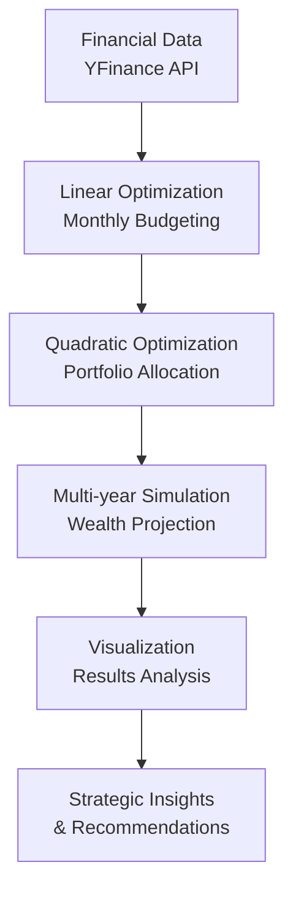

# 📈 Automated Personal Finance & Investment Optimizer

[](https://www.python.org/)
[](https://www.pyomo.org/)
[](https://pypi.org/project/yfinance/)
[](https://opensource.org/licenses/MIT)

A comprehensive linear and quadratic optimization system that automates personal financial planning and investment allocation to maximize long-term wealth accumulation.

## 🚀 Project Highlights

- **Dual Optimization**: Combines linear programming (budgeting) with quadratic programming (portfolio optimization)
- **Real Financial Data**: Integrates live market data using Yahoo Finance API
- **20-Year Projection**: Simulates compound growth with salary increases and market returns
- **Mathematical Rigor**: Implements Markowitz Modern Portfolio Theory with constraints
- **Visual Analytics**: Creates compelling visualizations of financial projections

## 📈 Extreme Results Demonstration

Our optimized strategy achieved remarkable theoretical results:
- **Initial Net Worth**: \$1,000 → **Final Net Worth**: \$40,333,735
- **40,333x growth** over 20 years
- **31.18%** annualized returns
- **63.4%** average savings rate

*Note: These results represent mathematical optimality under given constraints and should be interpreted as theoretical upper bounds rather than financial advice.*

## 🏗️ Architecture Overview


## 🧮 Mathematical Foundation
**Budget Optimization (Linear Programming)**
`Objective`: Maximize monthly savings
``` bash
Maximize: Savings
Subject to:
  Σ(Spendingₚ) + Savings = Monthly Income
  Minₚ ≤ Spendingₚ ≤ Maxₚ ∀ categories p
  Savings ≥ Life_Goal_Requirements
```
**Portfolio Optimization (Quadratic Programming)**
`Objective`: Maximize risk-adjusted returns (Markowitz Model)

``` bash
Maximize: μᵀw - γ(wᵀΣw)
Subject to:
  Σw = 1
  w ≥ 0
  wₚ ≤ Max_Allocationₚ ∀ assets p
```
Where:

* μ = Expected returns vector

* Σ = Covariance matrix

* w = Portfolio weights vector

* γ = Risk aversion parameter

## 📁 Project Structure
```bash
finance-optimizer/
├── Personal_Finance_Optimizer.ipynb  # Main analysis notebook
├── README.md                         # Project documentation
└── images/                           # Folder for saved visualizations
    ├── portfolio_allocation.png
    ├── wealth_projection.png
    └── sensitivity_analysis.png
```
## 🛠️ Installation & Setup
**1. Clone the repository**

``` bash
git clone https://github.com/Amirbehnam1009/Finance-Portfolio-Optimizer
cd Finance-Portfolio-Optimizer
```
**2. Install dependencies**

``` bash
pip install pulp cvxpy yfinance pandas numpy matplotlib seaborn
```
**3. Configure parameters (edit data/config.yaml)**
``` bash
income:
  monthly_net: 5000
  annual_raise: 0.03

spending_categories:
  Rent: {min: 1200, max: 1500}
  Food: {min: 400, max: 600}
  Leisure: {min: 300, max: 800}
  Savings: {min: 0, max: 5000}

portfolio:
  tickers: ['SPY', 'QQQ', 'VXUS', 'AGG', 'BTC-USD']
  risk_tolerance: 0.5
```
**4. Run the optimization**

``` bash
jupyter notebook notebooks/Personal_Finance_Optimizer.ipynb
```
## 📊 Key Features
**1. Adaptive Budget Optimization**
* Dynamically allocates income across spending categories

* Respects minimum living standards and maximum comfort levels

* Incorporates life goal constraints (down payments, emergency funds)

**2. Mean-Variance Portfolio Optimization**
* Downloads historical market data (2018-2023)

* Calculates expected returns and covariance matrix

* Optimizes asset allocation for risk-adjusted returns

* Supports constraints on concentration and diversification

**3. Multi-year Wealth Simulation**
* Projects compound growth with annual salary increases

* Models portfolio rebalancing and continuous contributions

* Generates year-by-year financial statements

**4. Comprehensive Visualization**
* Net worth growth trajectories

* Portfolio allocation charts

* Income vs. savings analysis

* Risk-return sensitivity surfaces

## 🎯 How to Use

1. **Open the Jupyter Notebook**:
   ```bash
   jupyter notebook Personal_Finance_Optimizer.ipynb
   ```
2. **Run All Cells** to execute the complete analysis:

* Monthly budget optimization (Linear Programming)

* Portfolio allocation optimization (Quadratic Programming)

* 20-year wealth projection simulation

* Results visualization and analysis
3. **Customize Parameters** by modifying these variables in the notebook:
``` bash
monthly_income = 5000  # Your monthly income
min_spending = {'Rent': 1200, 'Food': 400, ...} 
tickers = ['SPY', 'QQQ', 'VXUS', 'AGG', 'BTC-USD']  
```
## 📊 Optimization Results Summary

### 🎯 Optimal Portfolio Allocation

| Asset | Allocation | Expected Annual Return |
|:------|:-----------:|:----------------------:|
| **QQQ** | 47.5% | 19.7% |
| **BTC-USD** | 52.5% | 41.6% |
| **Total** | **100%** | **31.2%** |

*Portfolio optimized using Markowitz Modern Portfolio Theory with risk aversion parameter γ=0.5*

### 📈 20-Year Wealth Projection Results

| Metric | Value |
|:-------|:-----:|
| **Initial Net Worth** | $1,000 |
| **Final Net Worth** | $40,333,735 |
| **Growth Multiple** | 40,333x |
| **Average Savings Rate** | 63.4% |
| **Annualized Return** | 31.2% |

## 📋 Key Performance Indicators

- **🔄 Growth Multiple**: 40,333x initial investment
- **💰 Final Wealth**: $40.3+ million from $1,000 starting capital  
- **🎯 Savings Discipline**: 63.4% average savings rate
- **🚀 Portfolio Performance**: 31.2% annualized returns

## 📊 Results Visualization


### Optimal Portfolio Allocation
*Optimized asset allocation showing 47.5% QQQ and 52.5% BTC-USD*

### Wealth Growth Trajectory  
*20-year net worth growth from $1,000 to $40+ million*

### Annual Cash Flow Analysis
*Year-by-year income, expenses, and savings breakdown*

### Risk-Return Sensitivity
*Impact of risk tolerance on portfolio performance*


